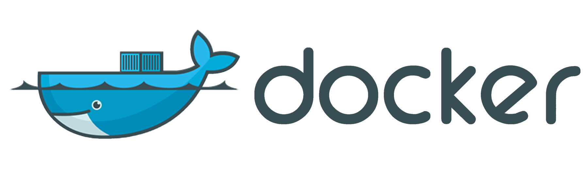

# [Bootcamp Web Developer Full Stack](https://www.thebridge.tech/bootcamps/bootcamp-fullstack-developer/)

### HTML, CSS,  JS, ES6, Node.js, Frontend, Backend, Express, React, MERN, testing, DevOps


## INTRODUCCIÓN A MAQUINAS VIRTUALES
  

Una máquina virtual de sistema es aquella que emula a un ordenador completo. En palabras  , es un software que puede hacerse pasar por otro dispositivo -como un PC- de tal modo que puedes ejecutar otro sistema operativo en su interior.

Las máquinas virtuales son una tecnología que permite crear múltiples entornos simulados o recursos dedicados desde un solo sistema de hardware físico. 

Podrás automatizar, gestionar y modernizar todas tus cargas de trabajo de virtualización.

Ejemplo : LINUX, MAC, WINDOWS...etc

 

### ¿Por qué elegir máquinas virtuales?
 
Las máquinas virtuales se crean para realizar tareas específicas cuya ejecución en un entorno host presentaría ciertos riesgos:
- Acceso a datos infectados por virus.
- Probar sistemas operativos.
- Virtualización de servidores.


| **Ventajas de las máquinas virtuales** | **Desventajas de las máquinas virtuales**|
| -- | -- | 
| Opción de **recuperación** ante desastres y distribución de aplicaciones. | La ejecución de varias máquinas virtuales en una máquina física puede provocar que el **rendimiento sea inestable**.| 
|**Gestión y mantenimiento fácil**, con una amplia disponibilidad.| Las máquinas virtuales son **menos eficientes y más lentas** que un Pc.|
| Es posible **ejecutar varios entornos** de sistemas operativos en un solo Pc.|
* **

## INTRODUCCIÓN A DOCKER
La idea detrás de Docker es crear **contenedores** ligeros y portables para las aplicaciones software que puedan ejecutarse en cualquier máquina con Docker instalado, independientemente del sistema operativo que la máquina tenga por debajo, facilitando así también los despliegues.
Un **contenedor** es un símil con un contenedor de los que suelen llevar los barcos de mercancías, que contiene distintos productos.

### PARA QUE SIRVE DOCKER

 * * *
#### CREAR CONTENEDOR DE NODEJS Y MONGO EN DOCKER 
 


* * * 
#### CREAR IMAGEN DE UN PROYECTO DE NODEJS COMO BASE EN DOCKER


* * *

 


 


## INSTALACIÓN DE DOCKER EN WINDOWS
Para instalar docker en windows tenemos que :

 1. Instalar **Docker Desktop**
```url
 https://docs.docker.com/desktop/windows/install/
  
```
2. Instalar  WSL
```
https://wslstorestorage.blob.core.windows.net/wslblob/wsl_update_x64.msi

```
3. Introducir el siguiente comando en **powershell**


 
```
wsl –set-default-version 2
```

4. Instalar Ubuntu desde **Microsoft Store** . En caso de que nos falle **Microsoft Store** descargar con el comando siguiente

```
wsl --install -d ubuntu
```


### NOTA IMPORTANTE
*En caso de aparecer el siguiente mensaje de error al instalar ubuntu
```
error del sistema de archivos (-2147416359)
 ```
Seguir el siguiente manual  https://materiageek.com/error-del-sistema-de-archivos-2147416359-en-el-solucion-de-windows-10/

Si no seguimos con el tutorial
 


5. Una vez instalado **Ubuntu** lo ejecutamos y procedemos a poner un nombre de usuario y contraseña


 
 
 
## Getting-started en docker
Para nuestro primero **Getting-started** ejecutamos el  

 ```
docker run -d -p 80:80 docker/getting-started
```


 
 y si nos vamos a **docker desktop** en el apartador **containers** y hacemos click sobre el siguiente icono se nos abrirá en el navegador el contenedor de docker que nos acabamos de descargar y arrancar

  

Y  finalmente en el navegador nos aparecerá lo siguiente.Es decir nuestra primera aplicación desplegada en un contenedor de docker

  


 